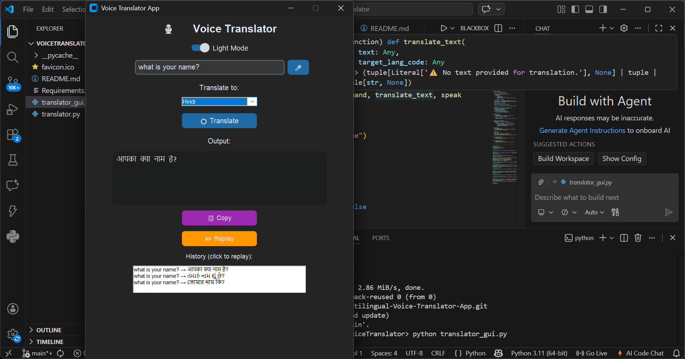

# Multilingual Voice Translator Application

A Python-based desktop application that converts spoken or typed input into translated text in multiple languages in real time. The application also supports speech output for translated text using text-to-speech functionality.

## Features

- Voice input using microphone
- Text input support
- Real-time multilingual translation
- Text-to-speech output
- Replay translated audio
- Copy translated text
- Translation history
- Dark/Light mode support
- Multiple language selection

## Tech Stack

- Python
- Tkinter / CustomTkinter
- SpeechRecognition
- Google Translate API
- gTTS (Google Text-to-Speech)

## How to Run

1. Clone the repository

```bash
git clone https://github.com/NibashisGorain/Multilingual-Voice-Translator-App.git